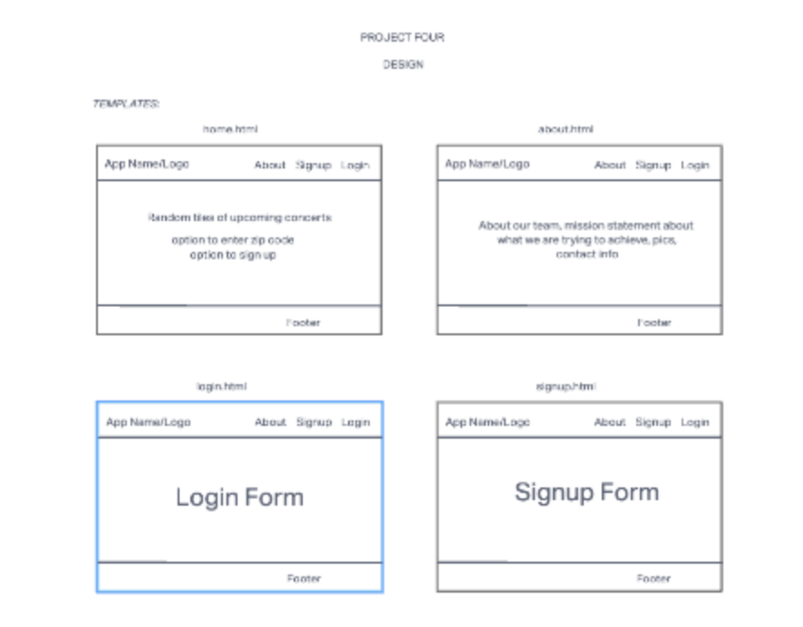
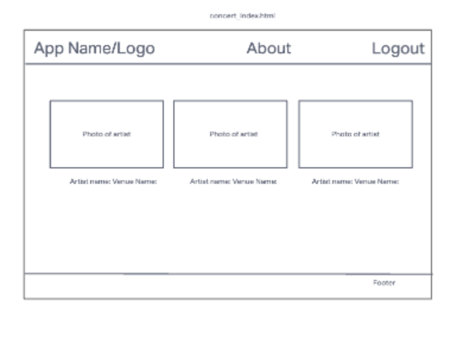
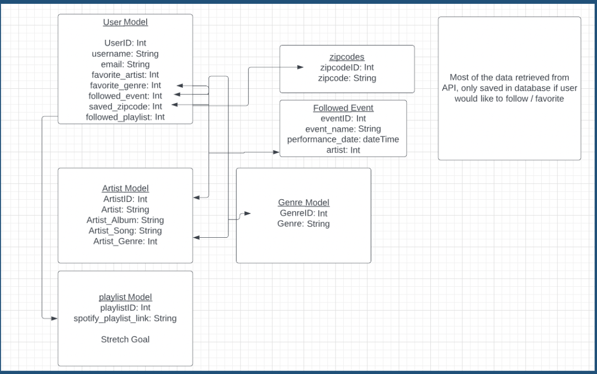

# Project Four

One of the biggest appeals of attending a concert is to surround yourself with people that share a common passion in the music you love. Unfortunately, sometimes when you bring friends along with you, they aren’t always as familiar with the artist as you and nothing is more depressing than singing your heart out to a song at a concert, just to see those around you have no idea what song you are listening to.

This app will help solve this problem by allowing a user to generate a suggested playlist consisting of songs of the artists that you would like to see.

If people can hear the songs before the concert, it will maximize their concert-going experiences and help you and your friends bond closer than ever!

# User Stories

- As a user, I want to be able to see a list of upcoming concerts near my zip code

- As a user, I should be able to sign up for an account and login to view my own personal dashboard

- As a user, I should be able personalize my dashboard to show my favorite upcoming concerts that I would be interested in attending.

- As a user, I should be able to customize my own dashboard by adding to my collection of favorite artists and their songs.

- As a user, I want to be able to forward upcoming concerts to other users

- As a user, I want to be able to save favorite genres and artists

- As a user, I want to be able to follow events I found

- As a user, I want to be able to share a generated playlist (stretch goal)

# Technologies Used

- Django
- PostgreSQL
- Express
- Mongoose
- MongoDB
- Material UI

# Screenshots

Wireframes:

ERD

# Getting Started

[Click here](https://trello.com/b/4SiMH32F/project-four) to see the project plan created with Trello.

[Click here](https://docs.google.com/presentation/d/1l0LYeI3x5Z4VRB37Hj9bIBeS6e0BZEK2YH54k4G5yU8/edit#slide=id.g15fcddaa9c0_3_5) to see the pitch deck presentation of our app.

[Click here](#) to see the deployed app!

# Future Enhancements

# Unsolved Problems
